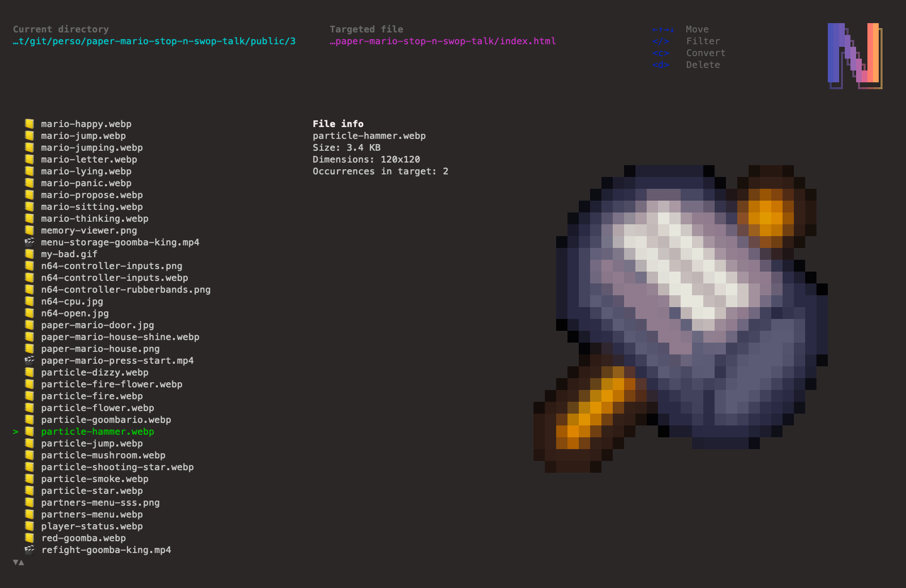

<p align="center">
    
	<br/>
	<br/>
	
	<br/>
	<br/>
	<i>AZsets Optimizer TUI</i>
	<br/>
Tool pour optimiser les assets d'un projet RevealJS.<br/>
(<b>azote</b> if french for <b>nitrogen</b>, ence the logo)
</p>

## Why 🤷

N'est-ce pas décevant lorsque vous avez passé 200h à bosser sur une conférence pour que le jour J rien ne fonctionne et que vous passez pour un glandu ?

Grâce à cet outil, facilitez-vous la vie et optimisez vos prez pour qu'elles fonctionnent même avec 47 onglets Chrome ouverts sur votre machine, elle-même branchée sur un projo bizarre qui prend toutes vos ressources !



## Features ✨

- Optimisations des assets :
	- conversion des fichiers vidéo en `.mp4` optimisés
	- conversation des images en `webp` optimisés
	- remplacement automatiques des références dans le `index.html|md` par les nouveaux noms de fichiers
	- suppression des anciens fichiers
- Autre :
	- filtrages des fichiers par nom
	- affichages des informations relatives aux fichiers
	- prévisualisation des images

## Install 💽

```bash
$ git clone ...
$ npm install -g .
```

## Usage 🧑‍💻

```bash
# Run the app
$ azotui

# Bon pour le moment on va pas se mentir y'a pas 3000 arguments disponibles...
$ azotui --help
```

## Tech stack 🤖

- NodeJS + React
- `ffmpeg`, `ffprobe` & `sharp` pour les opérations sur les fichiers média
- [meow](https://www.npmjs.com/package/meow) pour parser les arguments
- [ink](https://www.npmjs.com/package/ink) pour que ça soit joli
	- [ink-big-text](https://github.com/vadimdemedes/ink-big-text) pour le titre
	- [ink-gradient](https://github.com/vadimdemedes/ink-gradient) pour le gradient
		- https://github.com/bokub/gradient-string#available-built-in-gradients pour les gradients disponibles

## TODO 📋

- Corriger les bugs visuels (c'est pas critique)
- Proposer d'optimiser les `src` en `data-src` (active le lazy-loading de Reveal)
- Terminer la vidéo preview, si c'est pas trop gourmand
